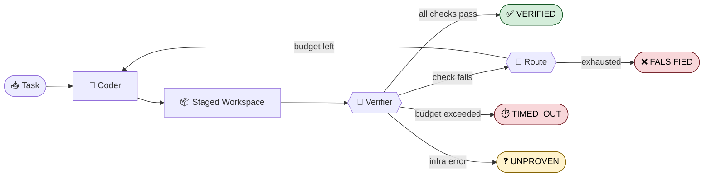
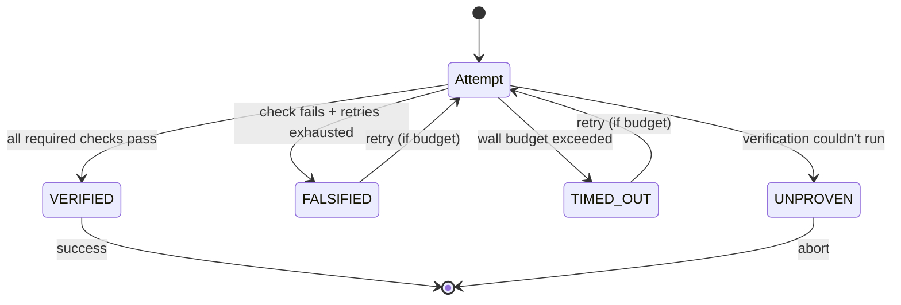
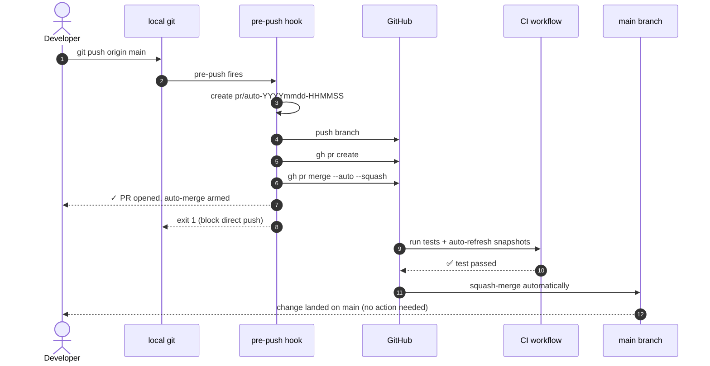
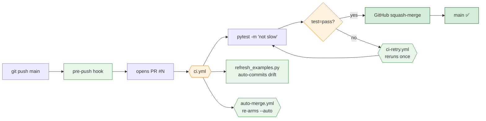
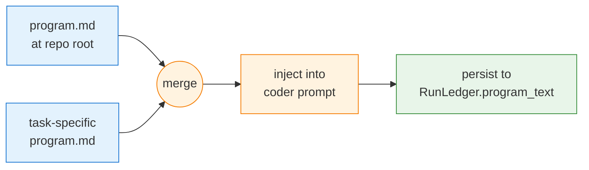

<div align="center">

# Correct by Construction

### **Verification-first control plane for coding agents.**

Staged execution · deterministic verification · bounded retries · reproducible ledgers

[](https://github.com/yhinai/true/actions/workflows/ci.yml)
[](LICENSE)
[](pyproject.toml)
[](src/cbc/headless_contract.py)
[](#-silent-pr-gated-workflow)
[](#)
[](#-the-four-verdicts)

</div>

---

## ✨ The Core Idea

> **LLMs claim. CBC proves.**



Every change lands in a **staged workspace** (local copy or ConTree branch). Every claim is checked by an **oracle** (pytest, ruff, typecheck, contracts, hypothesis, mutation). Every outcome is recorded in a reproducible `RunLedger` — with snapshot lineage, timings, and the exact prompt the agent received.

---

## 🎯 The Four Verdicts



| Verdict | Icon | Meaning |
|---|---|---|
| `VERIFIED`  | ✅ | All required checks pass |
| `FALSIFIED` | ❌ | At least one required check fails |
| `TIMED_OUT` | ⏱️ | Attempt exceeded `--max-seconds-per-attempt` |
| `UNPROVEN`  | ❓ | Verification could not run to completion |

---

## 🚀 Quickstart

```bash
uv sync --extra dev                                    # install
./scripts/run_compare.sh                               # smoke benchmark
uv run cbc run fixtures/oracle_tasks/calculator_bug/task.yaml --mode treatment --json \
    | jq '.verification.status'
# => "VERIFIED"
```

<details>
<summary><b>Live terminal output</b> — what you actually see</summary>

```console
$ uv run cbc run fixtures/oracle_tasks/calculator_bug/task.yaml --mode treatment
⠋ Running CBC on calculator_bug...
✅ Verified after 2 attempts (1.2s)

                           Verification Report
┏━━━━━━━━━━━━━━┳━━━━━━━━┳━━━━━━━━━━━┓
┃ Check        ┃ Status ┃  Duration ┃
┡━━━━━━━━━━━━━━╇━━━━━━━━╇━━━━━━━━━━━┩
│ oracle       │ passed │    0.04s  │
│ ruff         │ passed │    0.11s  │
│ pytest       │ passed │    0.83s  │
│ compileall   │ passed │    0.02s  │
└──────────────┴────────┴───────────┘

Ledger saved: artifacts/runs/fe59a3a27a2d/run_ledger.json
```

</details>

<details>
<summary><b>Aggressive timeout</b> — proves <code>TIMED_OUT</code> verdict</summary>

```console
$ uv run cbc run fixtures/oracle_tasks/calculator_bug/task.yaml \
      --max-seconds-per-attempt 0.001 --json | jq '.verification.status'
"TIMED_OUT"
```

</details>

---

## 🏗️ Architecture

```mermaid
flowchart TB
    subgraph CLI["⌨️ CLI Layer"]
        Main[main.py<br/>Typer commands]
        API[api/<br/>FastAPI read surface]
    end

    subgraph Control["🧠 Controller"]
        Orch[orchestrator.py<br/>run_task]
        State[run_state.py<br/>RunState + Router]
        Ledger[ledger_factory.py<br/>RunLedger]
        Gearbox[gearbox_runner.py<br/>asyncio.gather]
        Scoring[scoring.py<br/>CheckWeights]
    end

    subgraph Roles["👥 Roles"]
        Coder[coder.py]
        Planner[planner.py]
        Explorer[explorer.py]
    end

    subgraph Model["🔌 Model Adapters"]
        Codex[codex_exec.py<br/>streaming subprocess]
        Replay[replay.py]
        Prompts[prompts.py<br/>+ program.md]
    end

    subgraph Workspace["📦 Workspace Backends"]
        LocalBE[LocalBackend<br/>tempfile + copytree]
        ContreeBE[ContreeWorkspace<br/>container branches]
    end

    subgraph Verify["🔎 Verification"]
        Core[verify/core.py<br/>ThreadPoolExecutor]
        Oracle[oracles]
        Lint[ruff]
        Type[mypy/pyright]
        Prop[hypothesis]
        Contract[contracts]
        Mut[mutation]
    end

    subgraph Storage["💾 Storage"]
        SQLite[(cbc.sqlite3<br/>runs + snapshots)]
        Artifacts[artifacts/runs/]
    end

    Main --> Orch
    API --> SQLite
    Orch --> State
    Orch --> Gearbox
    Orch --> Coder
    Coder --> Codex
    Coder --> Replay
    Coder --> Prompts
    Coder --> Workspace
    Orch --> Core
    Core --> Oracle & Lint & Type & Prop & Contract & Mut
    Gearbox --> ContreeBE
    Orch --> Ledger
    Ledger --> Artifacts
    Orch --> SQLite
    Orch --> Scoring

    classDef cli fill:#e3f2fd,stroke:#1976d2
    classDef control fill:#fff3e0,stroke:#f57c00
    classDef role fill:#f3e5f5,stroke:#7b1fa2
    classDef model fill:#e8f5e9,stroke:#388e3c
    classDef ws fill:#fce4ec,stroke:#c2185b
    classDef verify fill:#fff9c4,stroke:#f9a825
    classDef store fill:#eceff1,stroke:#546e7a

    class Main,API cli
    class Orch,State,Ledger,Gearbox,Scoring control
    class Coder,Planner,Explorer role
    class Codex,Replay,Prompts model
    class LocalBE,ContreeBE ws
    class Core,Oracle,Lint,Type,Prop,Contract,Mut verify
    class SQLite,Artifacts store
```



---

## 📦 Sandboxing — Local vs ConTree

```mermaid
flowchart LR
    subgraph Local["🟢 --sandbox local (default)"]
        direction TB
        Src1[Source workspace] -->|shutil.copytree| Stage1[/tmp/cbc-xxxx]
        Stage1 --> Run1[coder writes<br/>verifier runs]
    end

    subgraph Contree["🔵 --sandbox contree"]
        direction TB
        Src2[Source workspace] -->|file-walk upload| Base[Base Image<br/>cbc/workspace/&lt;task&gt;:v1]
        Base -->|branch_async| B1[Branch 1<br/>candidate_a]
        Base -->|branch_async| B2[Branch 2<br/>candidate_b]
        Base -->|branch_async| B3[Branch 3<br/>candidate_c]
        B1 & B2 & B3 -.-> Pick[CheckWeights.select]
    end

    classDef local fill:#e8f5e9,stroke:#388e3c
    classDef contree fill:#e3f2fd,stroke:#1976d2
    class Src1,Stage1,Run1 local
    class Src2,Base,B1,B2,B3,Pick contree
```

> [!TIP]
> **Local** is always available (no container runtime). **ConTree** unlocks true parallel gearbox via Git-like branches — siblings can't interfere by construction.

---

## ⚡ Gearbox — Sequential vs Parallel

```mermaid
gantt
    title Gearbox wall-clock — 3 candidates × 5s each (illustrative)
    dateFormat ss
    axisFormat %Ss
    section Sequential (local)
    Candidate 1 :seq1, 00, 5s
    Candidate 2 :seq2, after seq1, 5s
    Candidate 3 :seq3, after seq2, 5s
    Select winner :done, after seq3, 1s
    section Parallel (contree)
    Candidate 1 :active, par1, 00, 5s
    Candidate 2 :active, par2, 00, 5s
    Candidate 3 :active, par3, 00, 5s
    Select winner :done, par4, 05, 1s
```



Running three candidates in parallel shrinks wall time from **~16s to ~6s** on this illustrative shape. Measured speedup is recorded by `scripts/bench_gearbox_parallel.py` into `reports/gearbox_speedup.json`.

---

## 🔁 Silent PR-gated Workflow

You keep typing `git push origin main`. The system handles branching, PR creation, CI gating, and merge — in the background, silently.



### What's wired up



### One-time setup per clone

```bash
ln -sf ../../scripts/git-hooks/pre-push .git/hooks/pre-push
uv tool install pre-commit && uv tool run pre-commit install
```

<details>
<summary><b>Emergency override</b> (for hook-path failures only)</summary>

```bash
ALLOW_DIRECT_MAIN_PUSH=1 git push origin main
```

Branch protection on the server still rejects unless temporarily disabled.
</details>

---

## 📝 Standing Instructions (`program.md`)

Drop a `program.md` at the repo root to give every run standing agent instructions. Per-task overrides live at `fixtures/oracle_tasks/<name>/program.md`.



```bash
echo "Prefer defensive coding. Use type hints everywhere." > program.md
uv run cbc run fixtures/oracle_tasks/calculator_bug/task.yaml --mode treatment
jq '.program_text' artifacts/runs/*/run_ledger.json | tail -1
# => "Prefer defensive coding. Use type hints everywhere."
```

---

## 🛠️ Install

| Scenario | Command |
|---|---|
| Minimum | `uv sync --extra dev` |
| + charts | `uv sync --extra dev --extra charts` |
| + ConTree | `uv sync --extra dev --extra contree` |

Requires **Python 3.11+** and **[uv](https://docs.astral.sh/uv/)**.

---

## ⌨️ CLI

<details open>
<summary><b><code>cbc run &lt;task.yaml&gt;</code></b> — run a single oracle task</summary>

| Flag | Default | Purpose |
|---|---|---|
| `--mode {baseline,treatment,review}` | `treatment` | Execution mode |
| `--controller {sequential,gearbox}` | `sequential` | Candidate strategy |
| `--sandbox {local,contree}` | `local` | Workspace isolation |
| `--agent {codex,replay}` | per task.yaml | Model adapter |
| `--max-seconds-per-attempt <float>` | `None` | Wall-clock budget per attempt |
| `--json` | off | Machine-readable stdout |
| `--stream` | off | NDJSON lifecycle events |

```bash
uv run cbc run <task.yaml> --mode treatment
uv run cbc run <task.yaml> --controller gearbox --sandbox contree --json
uv run cbc run <task.yaml> --max-seconds-per-attempt 60
```

</details>

<details>
<summary><b><code>cbc solve &lt;prompt&gt;</code></b> — zero-config intake from natural language</summary>

```bash
uv run cbc solve "Add a /health endpoint that returns 200"
uv run cbc solve "Fix the Node status badge labels" --verify "node test_status.js" --json
```

</details>

<details>
<summary><b>Benchmarks</b> — compare, controller-compare, poc</summary>

```bash
./scripts/run_compare.sh
./scripts/run_expanded_compare.sh
./scripts/run_controller_compare.sh
./scripts/run_poc_compare.sh --simulated --sample-size 2 --seed 42 --repetitions 2
python3 scripts/bench_gearbox_parallel.py
```

</details>

<details>
<summary><b>Review &amp; CI gates</b> for existing workspaces &amp; artifacts</summary>

```bash
uv run cbc review-workspace <task.yaml> /path/to/workspace
uv run cbc ci <task.yaml> /path/to/workspace
uv run cbc review-artifact <ledger.json> --json
uv run cbc ci-artifact <ledger.json> --json
```

</details>

<details>
<summary><b><code>cbc api</code></b> — FastAPI read surface</summary>

```bash
uv run cbc api
# then
curl http://127.0.0.1:8000/health
curl http://127.0.0.1:8000/runs
curl http://127.0.0.1:8000/benchmarks
```

</details>

---

## 📂 Repository Map

```
src/cbc/
├── main.py                      CLI entry (Typer)
├── api/                         FastAPI read surface
├── controller/
│   ├── orchestrator.py          run_task (sequential + gearbox)
│   ├── run_state.py             RunState, IterationRecord, AttemptTimeout
│   ├── routing.py               RETRY | COMPLETE | ABORT
│   ├── ledger_factory.py        build_final_ledger
│   ├── gearbox_runner.py        asyncio.gather
│   └── scoring.py               tunable CheckWeights
├── model/
│   ├── codex_exec.py            streaming subprocess
│   ├── replay.py                deterministic replay adapter
│   └── prompts.py               program.md injection
├── prompts/program_loader.py    global + per-task stacking
├── roles/                       coder / planner / explorer / reviewer
├── verify/core.py               parallel ThreadPoolExecutor
├── workspace/
│   ├── backends.py              WorkspaceBackend protocol
│   ├── contree_adapter.py       ContreeWorkspace
│   └── staging.py               create_workspace_lease
└── storage/
    ├── runs.py                  SQLite run index
    └── candidate_lineage.py     candidate_snapshots table
```

---

## 📊 Task Bank

<details>
<summary><b>10 oracle tasks checked in under <code>fixtures/oracle_tasks/</code></b></summary>

| Task | Kind |
|---|---|
| `calculator_bug` | single-file Python repair |
| `calculator_bug_codex` | single-file, live Codex lane |
| `checkout_tax_propagation` | multi-file propagation |
| `greeting_text_patch` | single-file text contract |
| `json_status_rollup` | multi-file aggregate contract |
| `live_codex_calculator` | live Codex lane |
| `price_format_property_regression` | property regression |
| `shell_banner_contract` | shell contract |
| `slug_shell_bug` | multi-file Python + shell |
| `slugify_property_regression` | property regression |

Plus a non-Python Node task bank (`status_badge_js_contract` and friends).

</details>

---

## 💾 Outputs

| Location | Content |
|---|---|
| `artifacts/runs/<run_id>/` | per-run ledger, transcript, verification report |
| `artifacts/examples/` | checked-in reference runs (CI-gated for drift) |
| `artifacts/cbc.sqlite3` | SQLite: `runs` + `candidate_snapshots` lineage |
| `reports/benchmarks/<id>/` | benchmark comparisons |
| `reports/gearbox_speedup.json` | sequential vs parallel wall-time |

---

## ✅ Full Verification Sweep

```bash
uv run pytest -q
./scripts/run_compare.sh
./scripts/run_expanded_compare.sh
./scripts/run_controller_compare.sh
./scripts/run_poc_compare.sh --simulated --sample-size 2 --seed 42 --repetitions 2
uv run python3 scripts/refresh_examples.py
python3 -m compileall src tests scripts
```

---

## 📣 Status

- ✅ Headless contract frozen at `2026-04-18.v2`
- ✅ CLI, FastAPI API, checked-in artifacts, benchmark reports
- ✅ Replay + live Codex adapters, both reproducible
- ✅ Sequential + gearbox controllers (gearbox parallel under ConTree)
- ✅ Zero-config intake via `cbc solve`
- ✅ PR-gated silent-merge workflow on `main`
- ✅ 132 tests passing, fast suite runs in ~11s

---

## 📚 Docs

- [Demo](docs/DEMO.md) · [Spec](docs/SPEC.md) · [Runbook](docs/RUNBOOK.md) · [Benchmark Plan](docs/BENCHMARK_PLAN.md) · [Status](docs/STATUS.md) · [Roadmap](plan.md)
- [Agent conventions (AGENTS.md)](AGENTS.md) · [Claude guidance (CLAUDE.md)](CLAUDE.md)
- Design specs: [`docs/superpowers/specs/`](docs/superpowers/specs/) · Implementation plans: [`docs/superpowers/plans/`](docs/superpowers/plans/)

---

<div align="center">

**MIT License** · see [LICENSE](LICENSE)

*Built on [opencolin/ralphwiggum](https://github.com/opencolin/ralphwiggum) (role decomposition), [opencolin/contree-skill](https://github.com/opencolin/contree-skill) (sandboxed branching), and [opencolin/opencode-cloud](https://github.com/opencolin/opencode-cloud) (parallel branching).*

</div>
