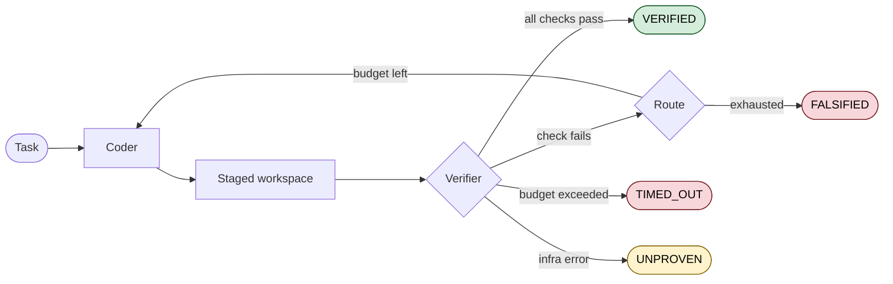
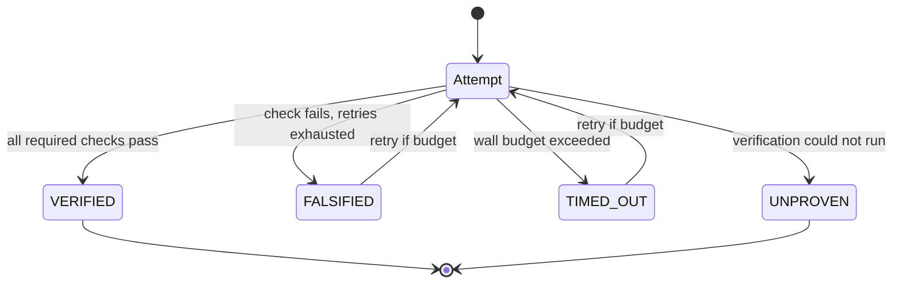
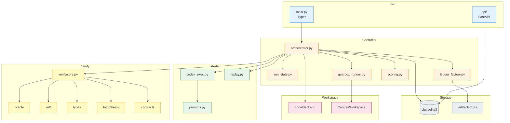
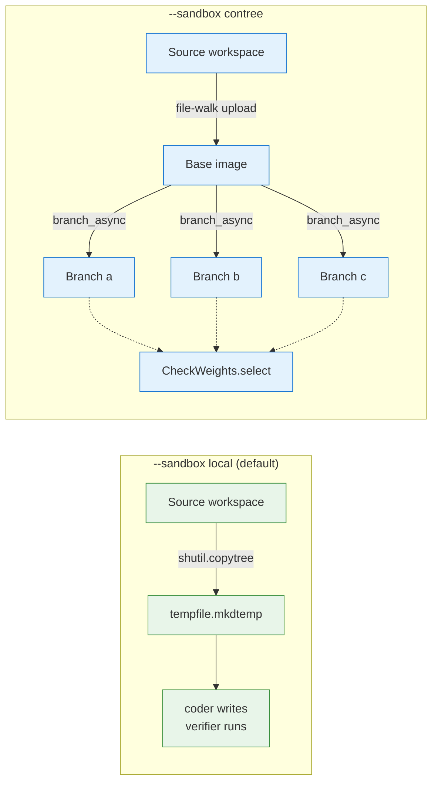
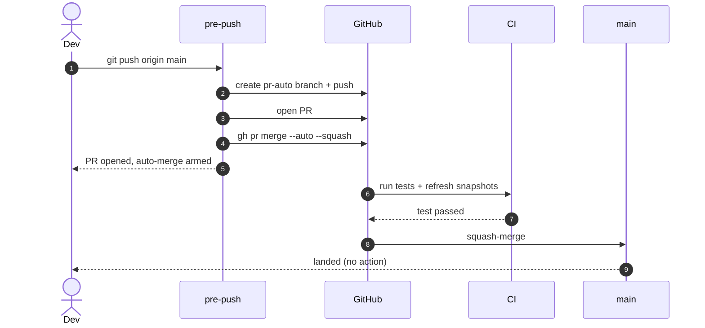
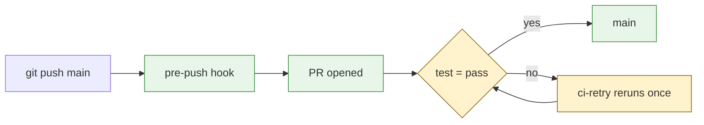
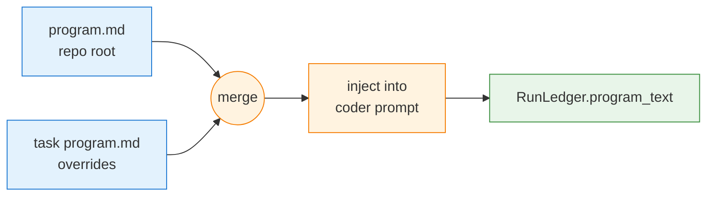

<div align="center">

# Correct by Construction

**Verification-first control plane for coding agents.**

[](https://github.com/yhinai/true/actions/workflows/ci.yml)
[](LICENSE)
[](pyproject.toml)
[](src/cbc/headless_contract.py)
[](#silent-pr-gated-workflow)
[](#)

</div>

---

## The Idea

LLMs claim. CBC proves.



Every change lands in a **staged workspace** (local copy or ConTree branch). Every claim is checked by an **oracle** — pytest, ruff, typecheck, contracts, hypothesis, mutation. Every outcome is recorded in a reproducible `RunLedger`: snapshot lineage, timings, and the exact prompt the agent received.

---

## Four Verdicts



| | Verdict | Meaning |
|---|---|---|
| ✅ | `VERIFIED`  | All required checks pass |
| ❌ | `FALSIFIED` | At least one required check fails |
| ⏱ | `TIMED_OUT` | Attempt exceeded `--max-seconds-per-attempt` |
| ❓ | `UNPROVEN`  | Verification could not run to completion |

---

## Quickstart

```bash
uv sync --extra dev
./scripts/run_compare.sh
uv run cbc run fixtures/oracle_tasks/calculator_bug/task.yaml --mode treatment --json \
    | jq '.verification.status'
# => "VERIFIED"
```

<details>
<summary><b>What it looks like</b> (interactive TTY)</summary>

```console
$ uv run cbc run fixtures/oracle_tasks/calculator_bug/task.yaml --mode treatment
⠋ Running CBC on calculator_bug...
✅ VERIFIED after 2 attempts (1.2s)

                           Verification Report
┏━━━━━━━━━━━━━━┳━━━━━━━━┳━━━━━━━━━━━┓
┃ Check        ┃ Status ┃  Duration ┃
┡━━━━━━━━━━━━━━╇━━━━━━━━╇━━━━━━━━━━━┩
│ oracle       │ passed │    0.04s  │
│ ruff         │ passed │    0.11s  │
│ pytest       │ passed │    0.83s  │
│ compileall   │ passed │    0.02s  │
└──────────────┴────────┴───────────┘

Ledger: artifacts/runs/fe59a3a27a2d/run_ledger.json
```

</details>

<details>
<summary><b>Force a timeout</b> (proves <code>TIMED_OUT</code>)</summary>

```console
$ uv run cbc run fixtures/oracle_tasks/calculator_bug/task.yaml \
      --max-seconds-per-attempt 0.001 --json | jq '.verification.status'
"TIMED_OUT"
```

</details>

---

## Architecture



---

## Sandboxing



> Local is always available. ConTree unlocks true parallel gearbox via Git-like branches — siblings can't interfere by construction.

---

## Gearbox: Sequential vs Parallel

```mermaid
gantt
    title Wall-clock, 3 candidates x 5s each (illustrative)
    dateFormat ss
    axisFormat %Ss
    section Sequential
    Candidate 1 :c1, 00, 5s
    Candidate 2 :c2, after c1, 5s
    Candidate 3 :c3, after c2, 5s
    Select      :done, after c3, 1s
    section Parallel (contree)
    Candidate 1 :active, p1, 00, 5s
    Candidate 2 :active, p2, 00, 5s
    Candidate 3 :active, p3, 00, 5s
    Select      :done, p4, 05, 1s
```



Measured by `scripts/bench_gearbox_parallel.py` into `reports/gearbox_speedup.json`.

---

## Silent PR-gated Workflow

You keep typing `git push origin main`. The system handles the rest.





### One-time setup per clone

```bash
ln -sf ../../scripts/git-hooks/pre-push .git/hooks/pre-push
uv tool install pre-commit && uv tool run pre-commit install
```

<details>
<summary><b>Emergency override</b></summary>

```bash
ALLOW_DIRECT_MAIN_PUSH=1 git push origin main
```

Branch protection on the server still rejects unless temporarily disabled.
</details>

---

## Standing Instructions (program.md)



```bash
echo "Prefer defensive coding. Use type hints." > program.md
uv run cbc run fixtures/oracle_tasks/calculator_bug/task.yaml --mode treatment
jq '.program_text' artifacts/runs/*/run_ledger.json | tail -1
```

---

## Install

| Need | Command |
|---|---|
| Minimum | `uv sync --extra dev` |
| + charts | `uv sync --extra dev --extra charts` |
| + ConTree | `uv sync --extra dev --extra contree` |

Python 3.11+ and [uv](https://docs.astral.sh/uv/).

---

## CLI

<details open>
<summary><b><code>cbc run &lt;task.yaml&gt;</code></b></summary>

| Flag | Default | Purpose |
|---|---|---|
| `--mode {baseline,treatment,review}` | `treatment` | Execution mode |
| `--controller {sequential,gearbox}` | `sequential` | Candidate strategy |
| `--sandbox {local,contree}` | `local` | Workspace isolation |
| `--agent {codex,replay}` | per task.yaml | Model adapter |
| `--max-seconds-per-attempt` | none | Wall-clock budget per attempt |
| `--json` | off | Machine-readable stdout |
| `--stream` | off | NDJSON lifecycle events |

```bash
uv run cbc run <task.yaml> --mode treatment
uv run cbc run <task.yaml> --controller gearbox --sandbox contree --json
uv run cbc run <task.yaml> --max-seconds-per-attempt 60
```

</details>

<details>
<summary><b><code>cbc solve &lt;prompt&gt;</code></b> (zero-config intake)</summary>

```bash
uv run cbc solve "Add a /health endpoint that returns 200"
uv run cbc solve "Fix the Node status badge labels" --verify "node test_status.js" --json
```

</details>

<details>
<summary><b>Benchmarks</b></summary>

```bash
./scripts/run_compare.sh
./scripts/run_expanded_compare.sh
./scripts/run_controller_compare.sh
./scripts/run_poc_compare.sh --simulated --sample-size 2 --seed 42 --repetitions 2
python3 scripts/bench_gearbox_parallel.py
```

</details>

<details>
<summary><b>Review &amp; CI gates</b></summary>

```bash
uv run cbc review-workspace <task.yaml> /path/to/workspace
uv run cbc ci <task.yaml> /path/to/workspace
uv run cbc review-artifact <ledger.json> --json
uv run cbc ci-artifact <ledger.json> --json
```

</details>

<details>
<summary><b><code>cbc api</code></b></summary>

```bash
uv run cbc api
curl http://127.0.0.1:8000/health
curl http://127.0.0.1:8000/runs
curl http://127.0.0.1:8000/benchmarks
```

</details>

---

## Repository Map

```
src/cbc/
├── main.py                  CLI entry (Typer)
├── api/                     FastAPI read surface
├── controller/
│   ├── orchestrator.py      run_task (sequential + gearbox)
│   ├── run_state.py         RunState, IterationRecord, AttemptTimeout
│   ├── routing.py           RETRY | COMPLETE | ABORT
│   ├── ledger_factory.py    build_final_ledger
│   ├── gearbox_runner.py    asyncio.gather
│   └── scoring.py           tunable CheckWeights
├── model/
│   ├── codex_exec.py        streaming subprocess
│   ├── replay.py            deterministic replay
│   └── prompts.py           program.md injection
├── prompts/program_loader.py
├── roles/                   coder, planner, explorer, reviewer
├── verify/core.py           parallel ThreadPoolExecutor
├── workspace/
│   ├── backends.py          WorkspaceBackend protocol
│   ├── contree_adapter.py   ContreeWorkspace
│   └── staging.py           create_workspace_lease
└── storage/
    ├── runs.py              SQLite index
    └── candidate_lineage.py candidate_snapshots
```

---

## Outputs

| Path | Content |
|---|---|
| `artifacts/runs/<run_id>/` | per-run ledger, transcript, verification report |
| `artifacts/examples/` | checked-in reference runs (CI-gated) |
| `artifacts/cbc.sqlite3` | runs + candidate_snapshots |
| `reports/benchmarks/<id>/` | benchmark comparisons |
| `reports/gearbox_speedup.json` | sequential vs parallel wall-time |

---

## Verification Sweep

```bash
uv run pytest -q
./scripts/run_compare.sh
./scripts/run_expanded_compare.sh
./scripts/run_controller_compare.sh
./scripts/run_poc_compare.sh --simulated --sample-size 2 --seed 42 --repetitions 2
uv run python3 scripts/refresh_examples.py
python3 -m compileall src tests scripts
```

---

## Status

- Headless contract frozen at `2026-04-18.v2`
- CLI, FastAPI, artifacts, benchmark reports — all live
- Replay + live Codex adapters, both reproducible
- Sequential + gearbox controllers; parallel gearbox under ConTree
- Zero-config intake via `cbc solve`
- `main` is PR-gated with silent auto-merge
- 132 tests; fast suite ~11s

---

## Docs

[Demo](docs/DEMO.md) · [Spec](docs/SPEC.md) · [Runbook](docs/RUNBOOK.md) · [Benchmark Plan](docs/BENCHMARK_PLAN.md) · [Status](docs/STATUS.md) · [Roadmap](plan.md) · [AGENTS.md](AGENTS.md) · [CLAUDE.md](CLAUDE.md) · [specs/](docs/superpowers/specs/) · [plans/](docs/superpowers/plans/)

---

<div align="center">

MIT · [LICENSE](LICENSE)

Patterns from [ralphwiggum](https://github.com/opencolin/ralphwiggum), [contree-skill](https://github.com/opencolin/contree-skill), [opencode-cloud](https://github.com/opencolin/opencode-cloud).

</div>
